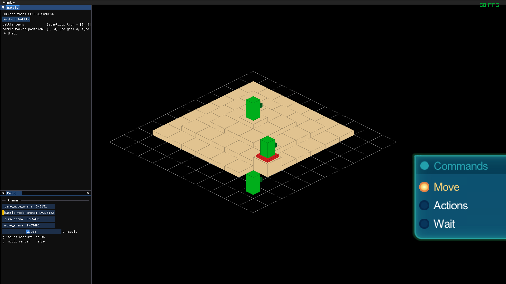

# Tactics RPG (Odin + Ralib)

A reimplementation of [liquidfire's Unity "Tactics RPG" tutorial](https://theliquidfire.com/projects/) with simple Odin code + Raylib (Work in progress).

The idea is to go back to this old tutorial I followed a decade ago when learning Unity and rewrite it without an engine, without the OOP-brain mindset and the overengineered code we did back then.

